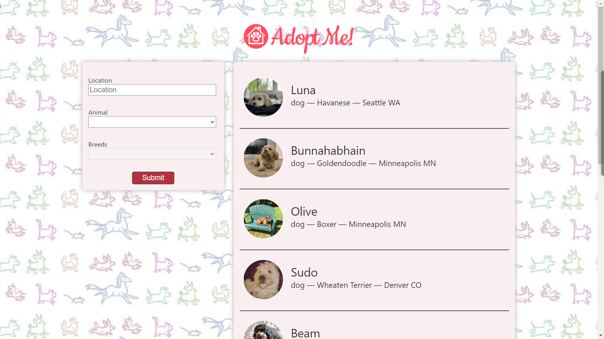

# Adopt Me - An adoption site in React

## How to Build/Run

First, clone the project using :

```bash
git clone git@github.com:Nexus-coder/pet_adoption_app.git
```

Second .run the command :

```bash
npm install
# or
yarn

```

Third, run the development server:

```bash
npm run dev
# or
yarn dev
# or
pnpm dev
```

## Table of contents

- [Overview](#overview)
  - [Screenshot](#screenshot)
  - [Links](#links)
- [My process](#my-process)
  - [Built with](#built-with)
  - [What I learned](#what-i-learned)
  - [Continued development](#continued-development)
  - [Useful resources](#useful-resources)
- [Author](#author)
- [Acknowledgments](#acknowledgments)

## Overview

This a react application that focuses on using the technology to make an app that you can use to get an adorable pet that will keep you company at home. It uses the best practices for React 18. This practices include:


### Screenshot




### Links

- Live Site URL: [Adopt Me](https://pet-adoption-app-theta.vercel.app/)

## My Process

### Built with

- Semantic HTML5 markup
- CSS custom properties
- Flexbox
- CSS Grid
- Mobile-first workflow
- [React](https://reactjs.org/) - JS library


### What I learned

I learnt how to use use Query which is a React library for caching.

To see how you can add code snippets, see below:

```js
export default async function fetchSearch({ queryKey }) {
    const { animal, location, breed } = queryKey[1];
    const res = await fetch(`http://pets-v2.dev-apis.com/pets?animal=${animal}&location=${location}&breed=${breed}`);
    if (!res.ok) { throw new Error(`pet search not okay: ${animal}, ${location}, ${breed}`); }
    return res.json();
}
```

### Continued development

I would still like to continue focusing on learning about cache with react and also to learn how just how the whole framework operates too.So I will use it in the coming projects in order to get a better understanding of it.

### Useful resources

- [Tanstack Query](https://tanstack.com/query/latest) - This helped me for searching querying and even caching of my requests that come from the api. I really liked this pattern and will use it going forward.

## Author

- Website - [Apopt Me](https://pet-adoption-app-theta.vercel.app/)
- Twitter - [@AndrewK51659634](https://twitter.com/AndrewK51659634)


## Acknowledgments

I would like to acknowledge frontend masters where I actually git the inspiration and the knowledge to make the above application.
